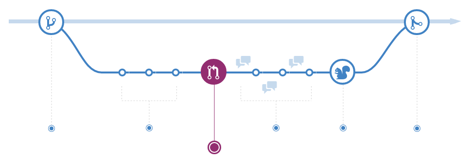

Github Flow是一个基于分支的轻量级的工作流，用来帮助团队或项目定期的发布。这个指南里介绍了Github Flow是如何动作的以及为什么要用Github Flow。

## 创建分支

在开发项目的过程时，你随时都可能会有一堆新特性或想法需要处理，有一些已经可以开始了，但是有一些可能还没有。分支的存就是帮你来管理这些工作的。

在项目中创建了新分支后，你实际是创建了一个可以用来尝试新想法的环境。在这个分支中进行的更改并不会影响`master`分支，因此你可以尽情的实验并提交修改，在变更通过团队协作人员评审之前是不可能被合并的。

### 小贴士

分支是Git中一个很重要的理念，整个Github Flow都是基于分支的。只有一个规则：`master`分支中的任何东西都是可以发布的。

介于此，新功能或是Bug修复分支最好是基于 master 的。分支的名称应该起的有意义一些（如：`refactor-authentication`, `user-content-cache-key`, `make-retina-avatars`），这样其他人才能对变更内容和目的一目了然。

## 进行修改

分支创建好以后，就可以进行修改了。在添加、修改或是删除某个文件后，进行一次提交，把这些变更添加到你的分支里。这些提交记录了你在这个功能分支上所做的一切。

通过这些提交，其他人员还可以看到你变更的历史，以便帮助他们理解你做了哪些工作，为什么要做。每个提交都有一个提交注释，描述了这次提交的内容和原因。每个提交是一个单独的变更单元。这使得你在遇到Bug或想调整程序方向的时候可以回滚。

### 小贴士

提交注释很重要，因为当你提交的内容被推送到服务器的时候，会把这些提交注释显示为追踪信息。提交信息写的越清楚，他人就越容易理解（你所做的工作）并提供相应的反馈。

## 创建Pull Request

Pull Request是开始讨论你的提交成果的地方。由于它与Git仓库紧密的集成在了一起，因此其他人可以很明确的看到如果他们接受你的请求的话，会合并哪些变更。

在开发过程时随时可以创建Pull Request ：当你想跟大家分享一些截图或是大致的想法，但是仅有一点甚至一点代码都没有的时候；当你被困扰需要帮助的时候；或者是当你已经准备好让大家评审你的工作的时候等等。在你的Pull Request中可以使用Github的@系统邀请特定的人员或是团队给你反馈，不管他们是近在咫尺还是天涯海角。

### 小贴士

Pull Request对于为开源项目做贡献或是管理共享仓库的变更很有用。如果你正在使用Fork & Pull模式，Pull Request提供了一种通知项目维护人员你想让他们考虑接纳你的变更的途径。而如果你使用的是共享仓库模式，Pull Request能帮助你在把变更合并到master之前发起代码评审以及对于修改建议的讨论。

## 评审代码

创建了Pull Request之后，评审你变更的人或团队有可能会有问题或是评论。有可能是编码风格不符合项目的要求，也可能是变更没有单元测试代码，也有可能什么问题都没有。Pull Request设计的初衷就是鼓励和发现这类的讨论。

你可以受到讨论或是返回的启发后继续提交代码。如果某个人评论说你忘了做某件事，或者说你的代码里有个Bug的话，你可以在你的分支里修改然后再提交。Github会在你的Pull Request视图中显示新的提交以及反馈信息。

### 小贴士

Pull Request的评论是用Markdown格式写的，因此你可以插入图片或emoji表情、使用格式化的文本或是其他轻量级的排版。

## 部署

在你的Pull Request被评审之后，并且也经过了测试，你就可以在生产环境中部署并进行测试了。而如果你的分支在部署后出现了问题，你可以把master中的代码部署到生产环境中。

## 合并

既然你的变更已经在生产环境测试通过了，是时候把这些代码合并到master分支当中了。

合并以后，Pull Request中会保留一个关于这次变更的历史记录。由于它们是可以被搜索的，这可以让所有人去回头查看这些变更去理解为什么做这个决定以及如何做的决定。

### 小贴士

在Pull Request中加入指定格式的关键字，就能把代码和问题（Issue）联系起来。当你的Pull Request被合并的时候，与之关联的问题也一并被关闭了。例如：输入 `Closes #32` 会关闭编号为32的问题。参考[帮助文档](https://help.github.com/articles/closing-issues-via-commit-messages)已获得更多信息。
